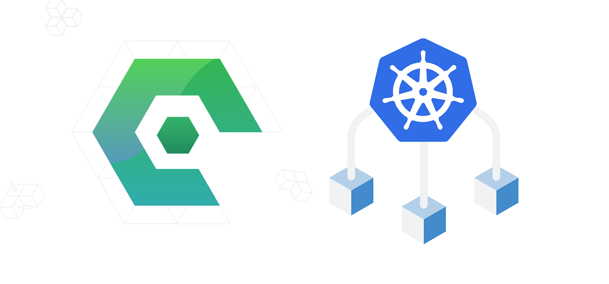
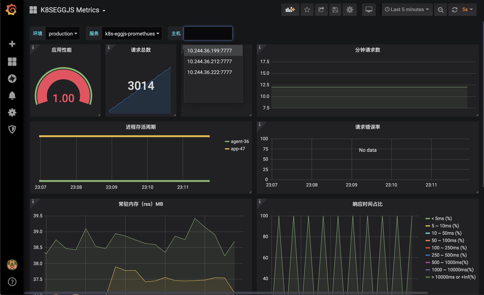

## K8S-EGGJS

**[EggJS 云原生应用硬核实战（Kubernetes+Traefik+Helm+Prometheus+Grafana）教程](https://juejin.cn/post/6900790776909791240)**

  

    
前端云原生群

    
  

  

    
公众号

    
  

  

    
为少的微信

    
  

